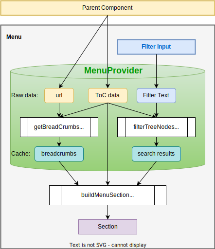

# Table of Content Demo Application

This is a react app I created as a test assignment to show my front-end skills. The application demonstrates working with a tree menu, which is often used in documentation sites. It displays navigation, switches links and shows selected page (for now the app shows only page title).

How to start application locally:

```bash
nvm use
npm ci
npm run dev
```

## App Overview

The requirements for the task determined the tech stack: use react and css modules, fetch data asynchronously, do not use any libraries for building menus and trees.

I used vite and vitest for building and testing.

So, from a bird's eye view, the structure is as follows:

1. [main.tsx](./src/main.tsx) is an entrypoint. It finds the root DOM element and render the App.
1. [app/](./src/app/) contains all app-level code
    - [App.tsx](./src/app/App.tsx) is where the app is described. It renders app router. If there were any providers, they would also be used here
    - [Router](./src/app/Router) declares app routes. Now there is only one, because all the pages are the same, and there is no unique content on the pages
    - [Root](./src/app/Root) renders the page content
1. [features/](./src/features/) contains feature-specific code, directory per feature:
    - [toc/](./src/features/toc/) is the main (and only) feature that build a menu tree
        - [types](./src/features/toc/types.ts) describe data model
        - [core/](./src/features/toc/core/) implements pure logic to work with menu data
        - [api/](./src/features/toc/api/) contains data fetching logic
        - [ui/](./src/features/toc/ui/) has components to render the feature
1. [components/](./src/components) contains all bricks that are not bound to the app domain, e.g. [Layout](./src/components/Layout) or [Transitions](./src/components/Transitions).
1. [hooks/](./src/hooks) contains any general logic shared between components, like:
    - [useRequestWithPlaceholder](./src/hooks/useRequestWithPlaceholder.ts) to fetch data. It works like an extremely simplified idea of react-query, that hook returns state of a query with some placeholders and flags
    - [useFilter](./src/hooks/useFilter.ts) holds shared logic for filter inputs
1. [toc.json](./public/toc.json) is a data structure that API sends to the client. The structure was defined by the task requirements

## Deep Dive into ToC Builder

Components composition:

1. So, the [Root](./src/app/Root/Root.tsx) component fetches the data from “API” (a static JSON file, actually), detects current url and renders the `Menu` by passing props to it.
1. The [Menu](./src/features/toc/ui/Menu/Menu.tsx) component wraps all its content to the [MenuProvider](./src/features/toc/ui/Menu/Context/MenuProvider.tsx) that holds menu data, filtering state and methods.
1. Then the [Menu](./src/features/toc/ui/Menu/Menu.tsx) renders menu `Filter` and menu `List` components.
1. The [Filter](./src/features/toc/ui/Menu/Filter/Filter.tsx) component just extracts data and methods from the menu context through hooks and render the [Input](./src/components/Input/Input.tsx) presenter.
1. The [List](./src/features/toc/ui/Menu/List/List.tsx) component render the menu tree from the top level using `Section` component.
1. The [Section](./src/features/toc/ui/Menu/Section/Section.tsx) render items on a specific level with `Item` component, and, if an item has children, renders nested sections recursively.
1. The [Item](./src/features/toc/ui/Menu/Item/Item.tsx) component has two modifications:
    - plain `Item` simply renders a single page in the menu with the desired styles and attributes
    - the `ItemToggle` renders an `Item` with a chevron and nested section. Independently manages the open/closed state so that only this subtree is rerendered when the state changes

Core logic:

1. So how does the [Section](./src/features/toc/ui/Menu/Section/Section.tsx) know which items need to be rendered? The top `Section` is rendered by the [List](./src/features/toc/ui/Menu/List/List.tsx) component, which passes the `parentId=''` property to the `Section`.
1. Then, `Section` uses the [useSectionItems](./src/features/toc/ui/Menu/Context/hooks.ts) hook, which extracts data from the MenuContext and passes it to the `buildMenuSection` method, gets items from it, and returns them back to the `Section`.
1. The [buildMenuSection](./src/features/toc/core/buildMenuSection.ts) is as plain as its name:
    - it takes `parentId` and finds its direct children in the API data
    - is takes `filter`, it sifts out mismatched pages
    - it takes `breadcrumbs` (path to the active page in a tree) and adjust item highlight mode based on active page url and its ancestors

Finding ancestors of a current page:

1. To properly highlight menu sections we have to know current page, and its ancestors up to the root. The path to the current page from the root of the tree is called “breadcrumbs”.
1. The [getBreadCrumbs](./src/features/toc/core/getBreadCrumbs.ts) methods takes the current page URL and ToC data, and simply traverse from the current page up to the root, collecting all visited pages in a breadcrumbs array.
1. [MenuProvider](./src/features/toc/ui/Menu/Context/MenuProvider.tsx) takes current page URL and all ToC data from the API, calls `getBreadCrumbs` method and store the result in the context. If the current URL changes, we need to rebuild the breadcrumbs as well. And vice versa, if the path remains the same, we don't need to rebuild the breadcrumbs. So, we can store computed breadcrumbs in context to reuse them when highlighting menu sections.

Filtering tree:

1. When a user types text, we should find all the pages suitable for the input. Even if they are somewhere deep in the tree. So we have to inspect all pages in the tree.
1. We can’t draw items “hanging in the air”, so if we render a page, we have to render all its ancestors as well.
1. The [filterTreeNodes](./src/features/toc/core/filterTreeNodes.ts) method takes the ToC data and the filter text, and checks each page if it matches. If so, adds the page to the result set, and walks the tree up to the root, adding all parents pages to the result set as well.
1. The [MenuProvider](./src/features/toc/ui/Menu/Context/MenuProvider.tsx) uses [useFilter](./src/hooks/useFilter.ts) hook to manage search results. So, when user types a text, the `useFilter` hook calls the `filterTreeNodes` method and store its results. The `MenuProvider` holds the results in its context.
1. So, when the `Section` component is rendered, it passes data from the MenuContext to the `buildMenuSection`, including the set of filtered pages.
1. And the [buildMenuSection](./src/features/toc/core/buildMenuSection.ts) simply checks the section pages if they are in the filtered set.

Here is a diagram of the components:



## Available Scripts

In the project directory, you can run:

### `npm run dev`

Runs the app in the development mode.\
Open [http://localhost:5173](http://localhost:5173) to view it in the browser.

The page will reload if you make edits.

Uses [Vite](https://vitejs.dev/).

### `npm run preview`

Serves the app in the production mode.\
Open [http://localhost:4173](http://localhost:4173) to view it in the browser.

Uses [Vite](https://vitejs.dev/).

### `npm test`

Launches the test runner in the interactive watch mode.

Uses [Vitest](https://vitest.dev/) and [React Testing Library](https://www.npmjs.com/package/@testing-library/react).

### `npm run build`

Builds the app for production to the `build` folder.

Uses [Vite](https://vitejs.dev/).

### `npm run lint`

Runs code linters to check dumb errors and code style.

Uses [eslint](https://www.npmjs.com/package/eslint) and [stylelint](https://stylelint.io/).

### `npm run lint:fix`

Fixes code issues and style.

Uses [eslint](https://www.npmjs.com/package/eslint) and [stylelint](https://stylelint.io/).
